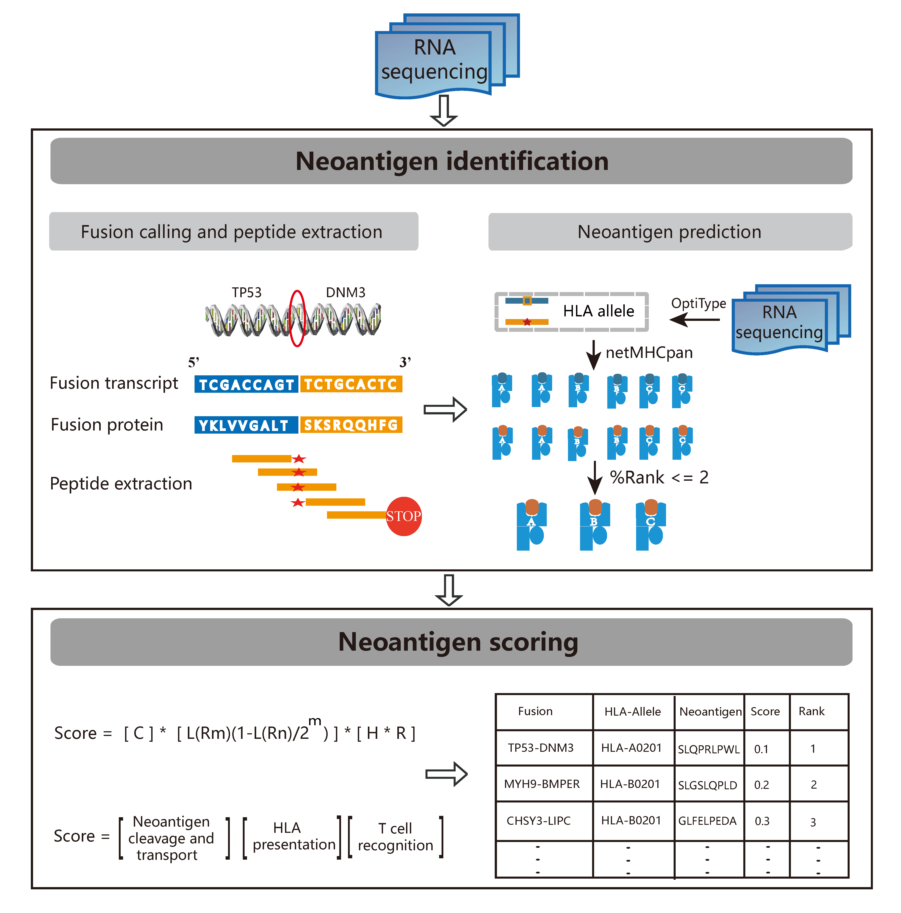

# neoFusion: a computational pipeline for gene fusion neoantigen identification and immunogenicity assessment  
  
Fusion, which is an important class of somatic mutations, is an ideal source of tumor-derived neoantigens for creating an open reading frame. Given RNAseq sequencing data as input, neoFusion identify and evaluate the potential immunogenicity of gene fusion based neoantigen. neoFusion is the first pipeline for identifying and prioritizing fusion neoantigen. Detailed information please refer to citation.       

#### Citation:   
The landscape of tumor fusion neoantigens: a pan-cancer analysis, Submitted, 2019.    

     
## Dependencies   

#### Required software:  
* [NetMHCpan 4.0](http://www.cbs.dtu.dk/cgi-bin/nph-sw_request?netMHCpan)
* [OptiType](https://github.com/FRED-2/OptiType)
* [netchop](http://www.cbs.dtu.dk/cgi-bin/nph-sw_request?netchop)
* [STAR-Fusion](https://github.com/STAR-Fusion/STAR-Fusion)
* [ pepmatch ]  module of MuPeXI

#### Python2 package     
     xgboost
     biopython
     scikit-learn
     pandas
     numpy
     subprocess
     multiprocessing
     pickle   

#### reference  
     download from (https://data.broadinstitute.org/Trinity/CTAT_RESOURCE_LIB/)    
     please refer to STAR-Fusion for more detail.    
     All the other needed materials can be found at data directory   

## Installation   
#### Install via Docker, highly recommended   
Docker image of neoFusion is available at https://hub.docker.com/r/bm2lab/neofusion/.   
if you have docker installed, you can pull the image like so:   
    
    docker pull bm2lab/neofusion

#### Install from source, not recommended   
To install  neoFusion, you just need download neoFusion.py and all the described dependencies.

## Usage    
if install from docker:
    
    docker run -it bm2lab/neofusion
    python /usr/local/neoFusion.py -h   

if install from source:    

    please edit the software path in neoFusion.py to the right path in your environment.  

Two mode are provided, denovo and midway. In denovo mode, you should provide fastq files.    
  
    python neoFusion denovo --left 1.fq  --right 2.fq  --hla  HLA-A02:01  --genome STAR_Fusion/GRCh38/ctat/

In midway mode, just provide fusion transcripts in fa format.    
    
    python neoFusion midway --fusion fusion.fa --hla HLA-A02:01     

## output 
The output file "neoscore.txt" contains all putative neoantigens information.

| Column | Description |
| - | -: |
| HLA | HLA type |
| mismatch | The different base number between mtpep and wtpep |
| MTpep | fusion derived neopeptide |
| MTpep_score | predicted score of mtpep output by netMHCpan|
| MTpep_aff | predicted affinity of mtpep output by netMHCpan |
| MTpep_rank | predicted bind rank(%) of mtpep output by netMHCpan |
| MTpep_comb | predicted comb score of mtpep, combined MHC score, cleavage score and TAP score output by netCTLpan|
| WTpep | pepmatch_db_x86_64 extracted normal peptide |
| WTpep_score |  predicted score of wtpep output by netMHCpan|
| WTpep_aff |  predicted affinity of wtpep output by netMHCpan |
| WTpep_rank |  predicted bind rank(%) of wtpep output by netMHCpan|
| WTpep_comb |  predicted comb score of wtpep, combined MHC score, cleavage score and TAP score output by netCTLpan|
| Hydro_Model | peptide immunity measurement based on amino acid hydrophobicity |
| R | T cell recognition score calculated based on TCR cross-reactivity |
| Score | Immunogenicity score of neoantigens |

## Contact   

Zhiting Wei    
1632738@tongji.edu.cn 

Qi Liu  
qiliu@tongji.edu.cn  

Biological and Medical Big data Mining Lab    
Tongji University    
Shanghai, China.

## neoFusion flowchart

