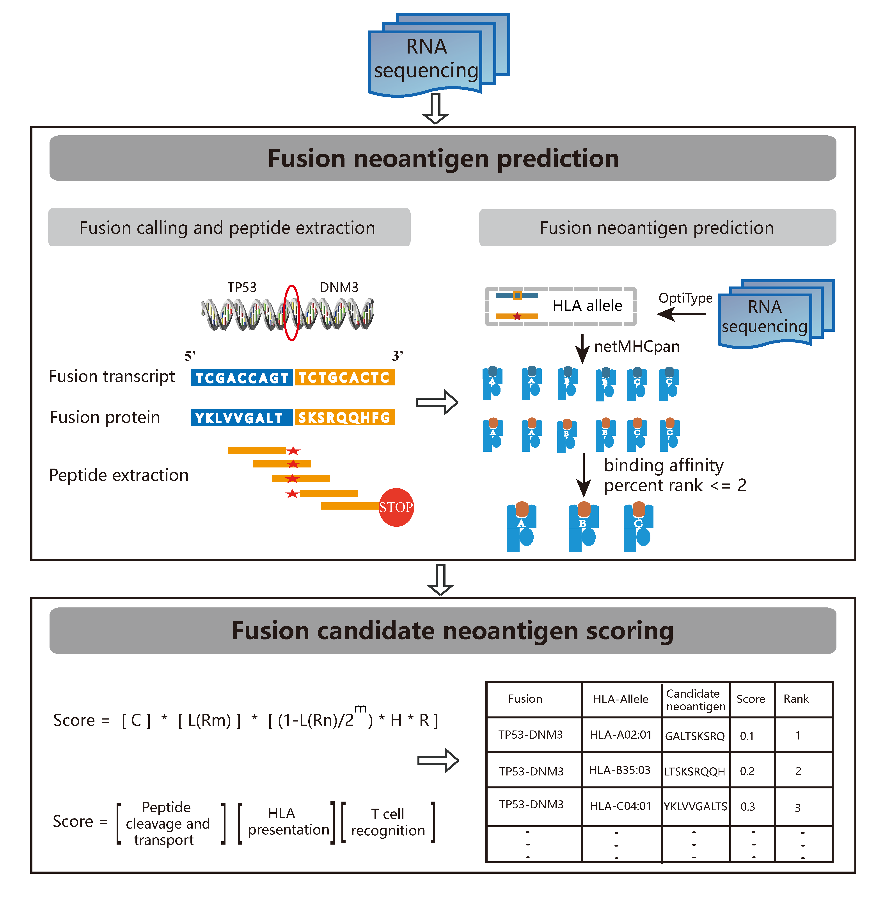

# neoFusion: a computational pipeline for gene fusion neoantigen prediction and immunogenic potential assessment  
  
Fusion, which is an important class of somatic mutations, is an ideal source of tumor-derived neoantigens for creating an open reading frame. Given RNAseq sequencing data as input, neoFusion predict and evaluate the immunogenic potential of gene fusion based neoantigen. neoFusion is the first pipeline for predicting and prioritizing fusion neoantigen. Detailed information please refer to citation.       

#### Citation:   
The Landscape of Tumor Fusion Neoantigens: A Pan-Cancer Analysis, iScience, 2019.    

     
## Dependencies   

#### Required software:  
* [NetMHCpan 4.0](http://www.cbs.dtu.dk/cgi-bin/nph-sw_request?netMHCpan)
* [OptiType](https://github.com/FRED-2/OptiType)
* [netchop](http://www.cbs.dtu.dk/cgi-bin/nph-sw_request?netchop)
* [STAR-Fusion](https://github.com/STAR-Fusion/STAR-Fusion)
* [ pepmatch ]  module of MuPeXI

#### Python2 package     
     xgboost
     biopython
     scikit-learn
     pandas
     numpy
     subprocess
     multiprocessing
     pickle   

#### reference
     neoFusion support two mode, denovo and midway. In midway mode, user do not need download reference. In denovo mode,
     please download reference as depicted:  
     The version of STAR-Fusion in our docker is 1.4.0, for compatibility, 
     download GRCh38 reference from (https://data.broadinstitute.org/Trinity/CTAT_RESOURCE_LIB/__genome_libs_StarFv1.3/)
     please refer to STAR-Fusion for more detail.    
     All the other needed materials can be found at data directory   

## Installation   
#### Install via Docker, highly recommended   
Docker image of neoFusion is available at https://hub.docker.com/r/bm2lab/neofusion/.   
if you have docker installed, you can pull the image like so:   
    
    docker pull bm2lab/neofusion

#### Install from source, not recommended   
To install  neoFusion, you just need download neoFusion.py and all the described dependencies.

## Usage    
if install from docker:
    
    docker run -it bm2lab/neofusion
    python /usr/local/neoFusion.py -h   

if install from source:    

    please edit the software path in neoFusion.py to the right path in your environment.  

Two mode are provided, denovo and midway. In denovo mode, you should provide fastq files.    
  
    python neoFusion.py denovo --left 1.fq  --right 2.fq  --hla  HLA-A02:01  --genome STAR_Fusion/GRCh38/ctat/

In midway mode, just provide fusion transcripts in fa format.    
    
    python neoFusion.py midway --fusion fusion.fa --hla HLA-A02:01     

## output 
The output file "neoscore.txt" contains all putative neoantigens information.

| Column | Description |
| - | -: |
| HLA | HLA type |
| mismatch | mismatch between mtpep and wtpep |
| MTpep | fusion derived candidiate neopeptide |
| MTpep_score | predicted score of mtpep output by netMHCpan|
| MTpep_aff | predicted binding affinity of mtpep output by netMHCpan |
| MTpep_rank | predicted binding affinity percent rank of mtpep output by netMHCpan |
| MTpep_comb | Combined score of binding affinity, proteasomal C terminal cleavage, and TAP transport efficiency|
| WTpep | pepmatch_db_x86_64 extracted normal peptide |
| WTpep_score |  predicted score of wtpep output by netMHCpan|
| WTpep_aff |  predicted binding affinity of wtpep output by netMHCpan |
| WTpep_rank |  predicted binding affinity percent rank of wtpep output by netMHCpan|
| WTpep_comb |  Combined score of binding affinity, proteasomal C terminal cleavage, and TAP transport efficiency|
| Hydro_Model | peptide immunogenic potential based on amino acid hydrophobicity |
| R | T cell recognition probability |
| Score | Immunogenicity score of neoantigens |

## Contact   

Zhiting Wei    
1632738@tongji.edu.cn 

Qi Liu  
qiliu@tongji.edu.cn  

Biological and Medical Big data Mining Lab    
Tongji University    
Shanghai, China.

## neoFusion flowchart

